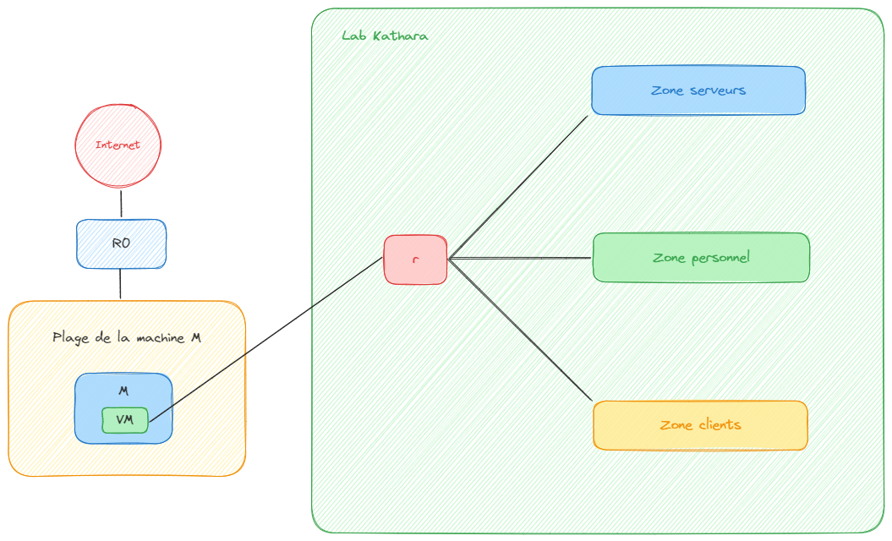
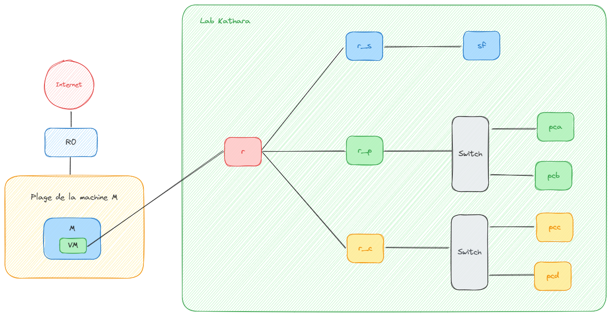
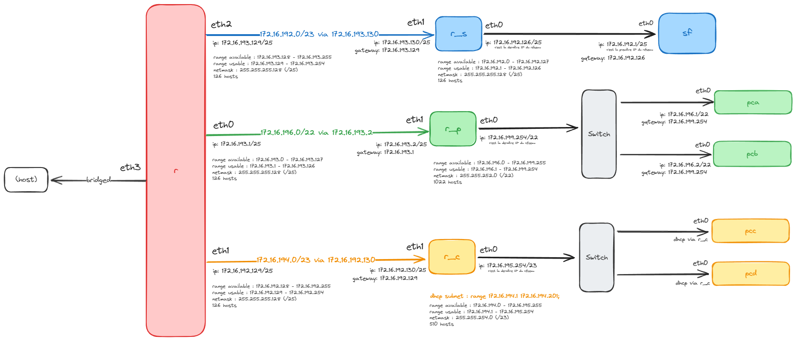

# SAE2.03 : Installation de services réseau (Sujet 2)

> Notre rapport se trouve dans le fichier [`REPORT.md`](./REPORT.md).

## Compétence (3)

**Administrer des systèmes informatiques communicants complexes**, avec les composantes essentielles suivantes :

- En maîtrisant l'architecture des systèmes et des réseaux
- En sécurisant le système d'information
- En appliquant les obligations légales, les normes en vigueur et les bonnes pratiques
- En mettant en oeuvre les mesures correctives adaptées à la nature des incidents identifiés
- En respectant les contraintes de performances, de coûts et d'efficacité énergétique
- En assurant la pérennité des données et des logiciels

## Contexte

Une entreprise qui fait un développement possède une plage publique d'adresses IP assez petite : **164.81.118.0/24**.
Cette plage est déjà configurée dans l'entreprise (elle correspond en réalité à une sous-plage d'adresses de notre infrastructure à l'Université de Limoges).
Vous n'aurez aucune modification à faire à cette configuration, vous la prenez telle-quelle.
Par contre, ce que vous allez devoir configurer est une infrastructure interne privée, qui sera liée à cette plage publique.

Comme l'entreprise est en pleine expansion, elle aura besoin de mettre en place une **zone personnel** pour ses développeurs et une **zone clients** qui permettra l'accès des clients au réseau lorsqu'ils visitent l'entreprise.
L'entreprise choisit d'utiliser une plage privée : P1.P2.P3.P4/n1 (**172.16.192.0/21**), qui sera divisée tel que :

- (au minimum) **950** adresses machine seront utilisées dabs la **zone personnel**
- (au minimum) **350** adresses machine seront utilisées dans la **zone clients**

En plus, l'entreprise aura besoin de 2 plages d'adresses privées supplémentaires (que vous allez devoir choisir vous-mêmes, en argumentant vos choix) :

- Une sous-plage d'adresses qui connecte les routeurs
- Une plage d'adresses de taille au moins 10 pour la "zone serveurs" qui contient les serveurs de l'entreprise

Avant d'être déployée, la configuration sera émulée et testée dans un outil dédié, pour s'assurer de son bon fonctionnement. Cet outil d'émulation est Kathará.



L'entreprise envisage d'utiliser l'architecture représentée dans cette figure. Votre machine physique sera la machine M, dans laquelle une machine virtuelle Kathará (notée VM dans la figure) sera active. La machine M a des adresses IP et du routage configurés.

Dans le rectangle vert-clair à droite de l'image, vous aurez l'architecture qui doit se trouver dans un lab Kathará, situé dans la VM Kathará. Le routeur R0, qui vou permet d’accéder à l'Internet sur la machine M, est également configuré.

Finalement, le routeur R est celui qui fait le lien entre la VM Kathará et l'infrastructure émulée de l'entreprise.

Dans cette SAE, votre but sera de tester l'architecture envisagée par l'entreprise.



Dans la zone "serveurs" (zone supérieure) il y a 2 machines :

- Un serveur `sf` dont l'adresse IP sera la **première adresse de la plage choisie** pour la zone "serveurs" ;
- Un routeur `r_s` qui aura deux interfaces réseau, l'une liée au routeur `r`, l'autre liée à la zone "serveurs", avec la **dernière adresse de la plage dédiée** à cette zone.

Dans la zone "personnel" (zone au milieu) il y a 3 machines :

- 2 machines utilisateur, `pca` et `pcb`, dont les adresses IP seront les **deux premières adresses de la plage dédiée** à la zone "personnel" ;
- Un routeur `r_p`, qui aura deux interfaces réseau, l'une liée au routeur `r`, l'autre liée à la zone "personnel", avec une adresse IP qui sera la **dernière de la plage dédiée** de cette zone-là.

Dans la zone "clients" (zone inférieure) il y a 3 machines :

- 2 machines utilisateur, `pcc` et `pcd`, qui doivent recevoir des adresses dynamiquement ;
- Un routeur `r_c`, lié d'un côté au routeur `r` et d'un autre côté avec une adresse constante (**dernière adresse** de la zone "clients"). Du côté client, **cette machine sert aussi de serveur DHCP**, pour l'adressage dynamique. La plage DHCP choisie devra accueillir un nombre de **200** machines.

La personne qui utilise le `pcb` est souvent avec les clients. Elle se rend compte qu'il serait bien de pouvoir manipuler son ordinateur (`pcb`) à distance à partir de la zone "clients". Elle veut de plus pouvoir déposer et retirer des fichiers, à partir de `pcb`, sur un serveur dédié de la zone "serveurs", notamment le serveur `sf`. Le responsable DSI doit donc lui mettre en place des services lui permettant :

- D'établir un tunnel vers `pcb`, qui de plus sera sécurisé ;
- De déposer et retirer des fichiers à partir de `pcb` vers le serveur `sf` de façon sécurisée.

## Questions

### 1. Préparer la simulation Kathará



#### a.

> Trouvez les sous-plages pour la zone personnel

- Zone "personnel" : `172.16.196.0/22` allant de `172.16.196.1` à `172.16.199.254` pouvant contenir 1022 machines.
- Zone "clients" : `172.16.194.0/23` allant de `172.16.194.1` à `172.16.195.254` pouvant contenir 510 machines.

> Les adresses des machines dans la *Figure 2*

- `r` (`eth0`) : `172.16.193.1/25`
- `r` (`eth1`) : `172.16.192.129/25`
- `r` (`eth2`) : `172.16.193.129/25`

- `r_s` (`eth0`) : `172.16.192.126/25`
- `r_s` (`eth1`) : `172.16.193.130/25` (relié au sous-réseau de `r` sur son interface `eth2`)

- `r_p` (`eth0`) : `172.16.199.254/22`
- `r_p` (`eth1`) : `172.16.193.2/25` (relié au sous-réseau de `r` sur son interface `eth0`)

- `r_c` (`eth0`) : `172.16.195.254/23`
- `r_c` (`eth1`) : `172.16.192.130/25` (relié au sous-réseau de `r` sur son interface `eth1`)

- `pca` (`eth0`) : `172.16.196.1/22` (dans le réseau de `r_p` sur son interface `eth0`)
- `pcb` (`eth0`) : `172.16.196.2/22` (dans le réseau de `r_p` sur son interface `eth0`)

- `pcc` (`eth0`) et `pcd` (`eth0`) : *dynamiquement grâce au DHCP configuré sur `r_c`*

- `sf` (`eth0`) : `172.16.192.1/25` (dans le réseau de `r_s` sur son interface `eth0`)

> La plage DHCP nécessaire

La plage DHCP doit accueillir un nombre de 200 machines,
alors la plage ira de `172.16.194.1` à `172.16.194.201` (avec un `netmask` de `255.255.254.0`).

#### b.

> Trouvez également des sous-plages pour la plage des routeurs...

- Allant de `r` à `r_s` : `172.16.193.128/25`
- Allant de `r` à `r_p` : `172.16.193.0/25`
- Allant de `r` à `r_c` : `172.16.192.128/25`

> ...et celle de la zone "serveurs".

- Zone "serveurs" : `172.16.192.0/25` allant de `172.16.192.1` à `172.16.192.126` pouvant contenir 126 machines.

#### c.

> Analysez comment le routage sera réalisé dans l'architecture décrite, quelles commandes devront être mises sur quelles machines ?

Il faudra faire du routage sur chaque machine avec `ip route`, par exemple.

Concernant le serveur DHCP, il faudra :

- Installer `isc-dhcp-server` avec `apt`
  - `apt update && apt install -y isc-dhcp-server`
- Démarrer le service `isc-dhcp-server` après configuration via `systemctl`
  - `systemctl enable --now isc-dhcp-server`

Concernant le serveur FTP, il faudra installer `vsftpd` avec `apt`. Il faudra aussi configurer un utilisateur pour avoir un accès au FTP.
Une fois la configuration terminée, il faudra aussi démarrer son service `vsftpd`.

#### d.

> Pour le service DHCP, comment mettre en place le service en question ? Préparez le contenu des fichiers de configuration.

Sur la machine `r_c`, il faudra modifier le fichier de configuration du serveur DHCP situé à `/etc/dhcp/dhcpd.conf` pour y écrire le contenu suivant :

```conf
ddns-update-style none;

# Réseau de `r_c` : "172.16.194.0/23".
subnet 172.16.194.0 netmask 255.255.254.0 {
  range 172.16.194.1 172.16.194.201;
  option routers 172.16.195.254;
  option domain-name-servers 9.9.9.9;
  default-lease-time 21600;
  max-lease-time 43200;
}
```

Il y a aussi le fichier situé à `/etc/default/isc-dhcp-server` qu'il faut éditer :

```bash
# On utilise uniquement les configurations requises (IPv4)
DHCPDv4_CONF=/etc/dhcp/dhcpd.conf
DHCPDv4_PID=/var/run/dhcpd.pid

# On écoute sur l'interface "eth0".
INTERFACESv4="eth0"
```

Pour les machines `pcc` et `pcd` qui vont utiliser le DHCP, il faudra exécuter la commande : `dhclient -v eth0`.

#### e.

> Quels service allez-vous mettre en place pour que la machine `pcb` puisse déposer et retirer des fichiers ?

Nous allons mettre en place un service FTP : `vsftpd` (Very Secure FTP Daemon) sur la machine `sf`.

La machine `pcb` pourra ainsi accéder au service en utilisant la commande `ftp`.

> Quels service pour l'accès à distance ?

Nous utiliserons SSH.

#### f.

> Quelles seront les configurations à faire sur chacune des machines ?

Il faudra configurer :

- les interfaces (`/etc/network/interfaces`) de chaque machine ;
- le service DHCP sur la machine `r_c` ;
- le service FTP sur la machine `sf` ;
- le service SSH sur la machine `pcb`.

> Comment allez vous les mettre en place ?

En utilisant des fichiers `.startup` qui seront exécutés lors du démarrage de la simulation Kathará.

### 2.

> Préparer l'émulation Kathará.

[Voir le fichier `lab.conf`](./lab.conf)

### 3.

> Mettre en place une configuration pérenne.

[Voir le dossier `shared`](./shared/)

### 4.

> Sur la machine `pcb` mettez en place les instructions qui vous permettront d'installer le service demandé.

```bash
# SSH étant déjà installé, on a juste à démarrer le serveur
systemctl start sshd
```

> Créez sur la machine `pcb` un utilisateur `admin` qui aura le mot de passe de votre choix.

```bash
useradd -m admin
# Ici, le mot de passe sera "admin".
echo "admin:admin" | chpasswd
```

### 5.

> Mettez en place le service FTP sur la machine `sf`.

```bash
# on ajoute notre utilisateur
useradd -m admin
echo "admin:admin" | chpasswd

# on installe le service
apt update && apt install -y vsftpd
# on démarre le service
/etc/init.d/vsftpd start 
```

Voir la configuration [`/etc/vsftpd.conf`](./shared/sf/vsftpd.conf).

### 6.

> A partir de ce moment, les tests suivant doivent marcher :

- [x] Toutes les machines peuvent joindre l'Internet
  - [x] Par nom de domaine
  - [x] Par adresse IP
- [x] Toutes les machines peuvent communiquer les unes avec les autres
- [x] La configuration DHCP demandée est correcte (l'adresse du routeur ne change pas, malgré l'attribution DHCP, les adresses de PCC et PCD sont dans la bonne plage) et le serveur est à l'écoute
- [x] Le service SSH `pcb` est démarré et à l'écoute, et permet l'établissement du tunnel sécurisé demandé à partir de toute autre machine
- [x] Le service FTP sur `sf` est configuré, démarré et à l'écoute et permet le transfert de fichiers

### 7.

> Ouvrez une capture Wireshark sur l'interface faisant le pont de la machine hôte avec Kathará.
> Avec la machine hôte, connectez vous à la machine `pcb` en SSH, puis fermez la connexion.
> Ensuite, en étant connecté à distance, faites un transfert de fichiers sur `sf` puis récupérez un autre fichier à partir de `sf`
>
> A partir de cette capture, retrouvez le fonctionnement des deux protocoles utilisés (SSH et FTP).

On va devoir établir une route entre la machine hôte (VM) et la machine `r_p` de Kathará.

```bash
# On obtient 172.17.0.2 avec l'interface eth3 sur la machine r.
# On tape cette commande sur la machine hôte.
sudo ip route add 172.16.196.0/22 via 172.17.0.2
```

On va se connecter au SSH de `pcb`.

```bash
ssh admin@172.16.196.2
# CTRL+D pour se déconnecter
```

On va devoir établir une route entre la machine hôte (VM) et la machine `r_s` de Kathará.

```bash
# On obtient 172.17.0.2 avec l'interface eth3 sur la machine r.
# On tape cette commande sur la machine hôte.
sudo ip route add 172.16.192.0/25 via 172.17.0.2
```

On va créer les fichiers qu'on va se transférer avec `sf`.

```bash
# Sur la machine locale
echo "Hello World" > /ftp_example.txt
```

```bash
# Sur la machine `sf`
echo "Hello world from sf!" > /home/admin/flag.txt
```

On va transférer ce fichier en FTP avec la commande `ftp`.

```console
$ ftp 172.16.192.1

Connected to 172.16.192.1.
220 (vsFTPd 3.0.3)
Name (172.16.192.1:iut): admin
331 Please specify the password.
Password:
230 Login successful.
Remote system type is UNIX.
Using binary mode to transfer files.
ftp> put /ftp_example.txt
local: /ftp_example.txt remote: /ftp_example.txt
200 PORT command successful. Consider using PASV.
150 Ok to send data.
226 Transfer complete.
12 bytes sent in 0.00 secs (133.1676 kB/s)
ftp> get flag.txt
local: flag.txt remote: flag.txt
200 PORT command successful. Consider using PASV.
150 Opening BINARY mode data connection for flag.txt (21 bytes).
226 Transfer complete.
21 bytes received in 0.00 secs (49.5358 kB/s)
ftp> bye
221 Goodbye.
```

Pour effectuer les captures, on peut utiliser la commande suivante :

```bash
# On va capturer le trafic sur l'interface eth3 de la machine hôte.
sudo tcpdump -i docker0 -w ./nom_fichier_capture.pcap
```

Vous pouvez retrouver les captures dans le dossier [`wireshark`](./wireshark).
