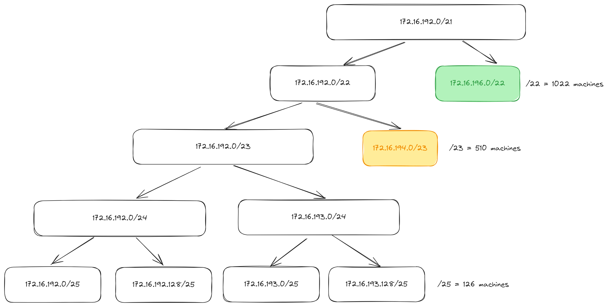
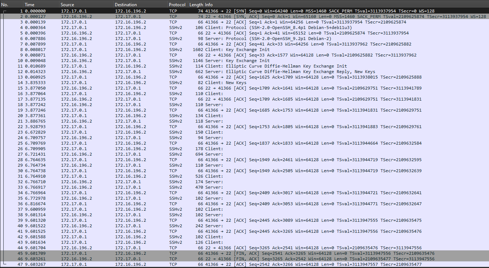
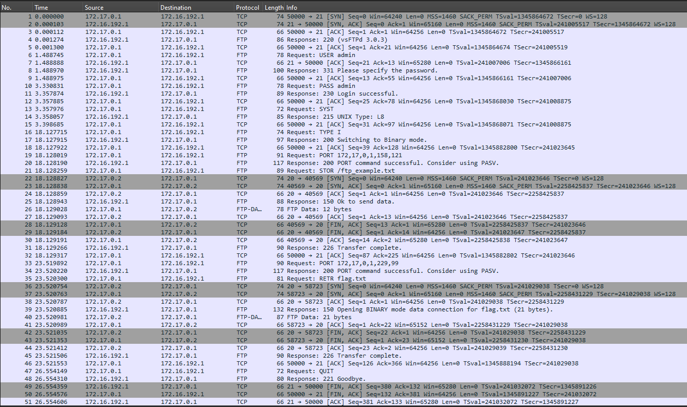

# Rapport de SAE 2.03: Installation de services réseau

## Consignes

- Votre analyse du problème et de l'architecture présentée. Cette partie devra détailler votre analyse théorique de l'exercice, et devra justifier le travail pratique qui a suivi pour la mise en place de Kathará.
- Vos choix par rapport à la configuration de chaque machine, y compris des services demandés (DHCP, le service d'accès à distance et le service de transfert de fichiers). Cette partie devra inclure des exemples de fichiers utilisés pour configurer Kathará, ainsi qu'une description des tests que vous avez utilisés pour vous assurer du bon fonctionnement du réseau (éventuellement aussi des screenshots montrant les résultats)
- Une description de l'utilité des services utilisés pour accéder à PCB à distance et pour le transfert des fichiers, en incluant votre compréhension de son comportement (voir la question 6 ci-dessus). Utilisez (des messages inclus dans) la capture Wireshark pour montrer que le protocole choisi permet l'établissement d'une connexion à distance, tout en garantissant la sécurité de la connexion.

Le rapport devra comporter entre 8 et 15 pages.
Il doit présenter une introduction, un résumé du sujet, un glossaire, etc...

## Analyse du problème

Dans le cadre de cette SAE, nous avions à mettre en place un réseau composé de trois zones : une zone "serveurs", une zone "personnel" et une zone "clients".

- Dans la zone "serveurs", nous devons mettre en place deux machines : `r_s` et `sf` (serveur FTP).
- Dans la zone "personnel", nous devons mettre en place trois machines : `r_p`, `pca` et `pcb` (contient un serveur SSH et un client FTP).
- Dans la zone "clients", nous devons mettre en place trois machines : `r_c` (serveur DHCP) ainsi que `pcc` et `pcd` qui utilisent tout les deux le serveur DHCP (sur `r_c`) pour récupérer leur adresse IP.

Un routeur principal `r` doit être mis en place pour connecter les trois zones entre elles.
Ainsi, nous devons mettre en place une plage qui connecte les routeurs.

L'entreprise a choisi d'utiliser la plage privée **172.16.192.0/21**.
La zone "personnel" doit pouvoir contenir **950** machines et la zone "clients" doit pouvoir contenir **350** machines. La plage DHCP de `r_c` (zone "clients") doit être configurée pour accueillir un nombre de **200** machines.

## Architecture finale

Après étude du problème, on a besoin de 6 sous-réseaux différents pour mettre en place l'architecture demandée.



Voici une proposition d'architecture pour répondre au problème posé.


On peut ainsi définir les adresses IP suivantes :

- `r`
  - (`eth0`) : `172.16.193.1/25`
    - `r_p` (`eth1`) : `172.16.193.2/25`
    - `r_p` (`eth0`) : `172.16.199.254/22`
      - `pca` (`eth0`) : `172.16.196.1/22`
      - `pcb` (`eth0`) : `172.16.196.2/22`
  - (`eth1`) : `172.16.192.129/25`
    - `r_c` (`eth1`) : `172.16.192.130/25`
    - `r_c` (`eth0`) : `172.16.195.254/23`
      - `pcc` (`eth0`) et `pcd` (`eth0`) : *dynamiquement grâce au DHCP configuré*
  - (`eth2`) : `172.16.193.129/25`
    - `r_s` (`eth1`) : `172.16.193.130/25`
    - `r_s` (`eth0`) : `172.16.192.126/25`
      - `sf` (`eth0`) : `172.16.192.1/25`

Pour être connecté à Internet, l'interface `eth3` sur la machine `r` est utilisé.
Dans notre émulation, elle sera *bridge* et mise en place automatiquement par Kathará.

## Configuration des machines

### Toutes les machines

#### Serveur DNS

Pour toutes les machines, sauf PCD et PCC qui seront configures dynamiquement par le serveur DHCP, nous utiliserons le serveur DNS de [Quad9](https://www.quad9.net/), un DNS ouvert et sécurisé pour une plus grande confidentialité.

Utilisation dans `resolv.conf` :
```conf
nameserver 9.9.9.9
```

Utilisation dans `dhcpd.conf` :
```conf
option domain-name-servers 9.9.9.9;
```

#### Service réseau

Une fois que toute la configuration réseau est faite dans les fichiers de démarrage (`.startup`), on redémarre le service réseau pour que les changements soient pris en compte.

```bash
/etc/init.d/networking restart
```

### Machine `r`

On a défini la configuration de son interface dans `/etc/network/interfaces`.

```plaintext
auto lo
iface lo inet loopback

auto eth0
iface eth0 inet static
address 172.16.193.1
netmask 255.255.255.128
post-up ip route add 172.16.196.0/22 via 172.16.193.2

auto eth1
iface eth1 inet static
address 172.16.192.129
netmask 255.255.255.128
post-up ip route add 172.16.194.0/23 via 172.16.192.130

auto eth2
iface eth2 inet static
address 172.16.193.129
netmask 255.255.255.128
post-up ip route add 172.16.192.0/23 via 172.16.193.130
```

On utilise `post-up` pour ajouter des routes statiques après le démarrage de l'interface.

On doit définir une masquerade pour que les machines utilisant `r` comme routeur puissent accéder à Internet.

```bash
iptables -t nat -A POSTROUTING -o eth3 -j MASQUERADE
```

On utilise l'interface `eth3` car c'est celle qui est connecté à Internet.

### Machine `r_s`

On a défini la configuration de son interface dans `/etc/network/interfaces`.

```plaintext
auto lo
iface lo inet loopback

auto eth0
iface eth0 inet static
address 172.16.192.126
netmask 255.255.255.128

auto eth1
iface eth1 inet static
address 172.16.193.130
netmask 255.255.255.128
gateway 172.16.193.129
```

### Machine `r_p`

On a défini la configuration de son interface dans `/etc/network/interfaces`.

```plaintext
auto lo
iface lo inet loopback

auto eth0
iface eth0 inet static
address 172.16.199.254
netmask 255.255.252.0

auto eth1
iface eth1 inet static
address 172.16.193.2
netmask 255.255.255.128
gateway 172.16.193.1
```

### Machine `r_c`

On a défini la configuration de son interface dans `/etc/network/interfaces`.

```plaintext
auto lo
iface lo inet loopback

auto eth0
iface eth0 inet static
address 172.16.195.254
netmask 255.255.254.0

auto eth1
iface eth1 inet static
address 172.16.192.130
netmask 255.255.255.128
gateway 172.16.192.129
```

Sur cette machine, nous devons également mettre en place un serveur DHCP pour les machines `pcc` et `pcd`.

Nous avons donc installé le paquet `isc-dhcp-server` pour mettre en place le serveur DHCP en utilisant la commande suivante en tant que `root` : `apt update && apt install -y isc-dhcp-server`.

Pour effectuer la configuration du serveur DHCP, nous avons modifié le fichier `/etc/dhcp/dhcpd.conf` pour y écrire la configuration suivante :

```conf
ddns-update-style none;

# Réseau de `r_c` : "172.16.194.0/23".
subnet 172.16.194.0 netmask 255.255.254.0 {
  range 172.16.194.1 172.16.194.201;
  option routers 172.16.195.254;
  option domain-name-servers 9.9.9.9;
  default-lease-time 21600;
  max-lease-time 43200;
}
```

Nous devons aussi modifier le fichier `/etc/default/isc-dhcp-server` pour utiliser seulement IPv4 et l'interface `eth0` :

```conf
DHCPDv4_CONF=/etc/dhcp/dhcpd.conf
DHCPDv4_PID=/var/run/dhcpd.pid
INTERFACESv4="eth0"
```

Enfin, on démarre le service DHCP avec la commande suivante : `systemctl start isc-dhcp-server`.

### Machine `sf`

On a défini la configuration de son interface dans `/etc/network/interfaces`.

```plaintext
auto lo
iface lo inet loopback

auto eth0
iface eth0 inet static
address 172.16.192.1
netmask 255.255.255.128
gateway 172.16.192.126
```

On doit créer un utilisateur que l'on va utiliser pour se connecter au serveur FTP.

```bash
useradd -m admin
echo "admin:admin" | chpasswd
```

On installe le serveur FTP : `vsftpd` (Very Secure FTP Daemon).

```bash
apt update && apt install -y vsftpd
```

On doit effectuer la configuration du service FTP en modifiant le fichier `/etc/vsftpd.conf` pour y écrire la configuration suivante :

```conf
listen=YES
listen_ipv6=NO
anonymous_enable=NO
local_enable=YES
write_enable=YES
dirmessage_enable=YES
use_localtime=YES
xferlog_enable=YES
connect_from_port_20=YES
secure_chroot_dir=/var/run/vsftpd/empty
pam_service_name=vsftpd
rsa_cert_file=/etc/ssl/certs/ssl-cert-snakeoil.pem
rsa_private_key_file=/etc/ssl/private/ssl-cert-snakeoil.key
ssl_enable=NO
```

Ici, on désactive la connexion anonyme, on active la connexion locale et l'écriture.

Finalement, on démarre le service FTP avec la commande suivante : `/etc/init.d/vsftpd start`.

### Machine `pcb`

On a défini la configuration de son interface dans `/etc/network/interfaces`.

```plaintext
auto lo
iface lo inet loopback

auto eth0
iface eth0 inet static
address 172.16.196.2
netmask 255.255.252.0
gateway 172.16.199.254
```

Sur cette machine, on doit mettre en place un serveur SSH pour permettre la connexion à distance.
On a déjà le serveur SSH installé par défaut sur la machine, il faut juste le démarrer avec la commande suivante : `systemctl start sshd`.

On doit créer un utilisateur que l'on va utiliser pour se connecter à distance.

```bash
# On ajoute l'utilisateur "admin" avec le mot de passe "admin".
useradd -m admin
echo "admin:admin" | chpasswd
```

On installe aussi un client FTP qui sera utilisé pour accéder au serveur FTP de `sf`.

```bash
apt update && apt install -y ftp
```

### Machine `pca`

On a défini la configuration de son interface dans `/etc/network/interfaces`.

```plaintext
auto lo
iface lo inet loopback

auto eth0
iface eth0 inet static
address 172.16.196.1
netmask 255.255.252.0
gateway 172.16.199.254
```

### Machine `pcc` et `pcd`

On a défini la configuration de son interface dans `/etc/network/interfaces` en utilisant `dhcp` pour que l'adresse IP soit attribuée dynamiquement par le serveur DHCP.

```plaintext
auto lo
iface lo inet loopback

auto eth0
iface eth0 inet dhcp
```

## Tests

Pour tester la configuration du réseau, on a utilisé la commande `ping` pour vérifier la connectivité entre les machines.

## Services

### Accès à distance

Pour permettre l'accès à distance à `pcb`, on utilise le protocole SSH (Secure Shell).
SSH est un protocole de communication sécurisé (les données sont chiffrées) qui permet d'accéder à une machine à distance et d'exécuter des commandes sur cette machine.

Pour se connecter à l'utilisateur `admin` de `pcb`, on utilise la commande suivante :

```bash
ssh admin@<addresse_de_pcb>
```

Ce service tourne sur le port 22, par défaut.



On remarque sur cette capture Wireshark que le protocole SSHv2 est utilisé pour établir une connexion à distance avec `pcb`.

1. Les deux machines échangent leur version du protocole SSH (SSHv2) : `Client: Protocol` et `Server: Protocol` ;
2. Les deux machines échangent des clés pour établir une connexion sécurisée : `Client: Key Exchange Init` et `Server: Key Exchange Init` ;
3. Le client envoie la clé de chiffrement au serveur : `Client: Elliptic Curve Diffie-Hellman Client Key Exchange Init` ;
4. Le serveur valide la réception de la clé de chiffrement et envoie une clé au client : `Server: Elliptic Curve Diffie-Hellman Server Key Exchange Reply, New Keys` ;
5. Le client accuse la réception de la clé : `Client: New Keys` ;
6. Tous les messages sont ensuite chiffrés et envoyés de manière sécurisée.

### Transfert de fichiers

Pour permettre le transfert de fichiers entre `pcb` et `sf`, on utilise le protocole FTP (File Transfer Protocol).

Nous avons choisi le serveur FTP `vsftpd` pour sa simplicité d'utilisation et sa sécurité (d'où le nom "Very Secure FTP Daemon").

Pour se connecter à `sf`, on utilise la commande suivante :

```bash
ftp <addresse_de_sf>
# On nous demande le nom d'utilisateur et le mot de passe.
# On se connecte avec l'utilisateur "admin" et le mot de passe "admin".
# On peut ensuite utiliser les commandes FTP pour transférer des fichiers :
# - `put` pour envoyer un fichier.
# - `get` pour récupérer un fichier.
# - `ls` pour lister les fichiers.
# - `cd` pour changer de répertoire.
# - `pwd` pour afficher le répertoire courant.
# - `bye` pour quitter le serveur FTP.
```

Ce service tourne sur le port 21, par défaut.



On remarque sur cette capture Wireshark que le protocole FTP est utilisé pour transférer des fichiers entre `pcb` et `sf`. Lorsqu'on transfère un fichier, le protocole `FTP-DATA` est utilisé pour envoyer les données du fichier.
