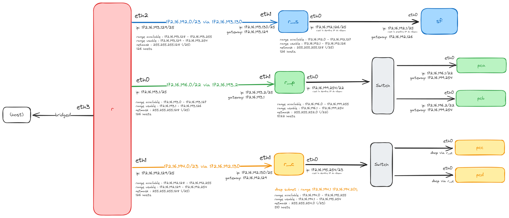

# Rapport de SAE 2.03: Installation de services réseau

## Consignes

- Votre analyse du problème et de l'architecture présentée. Cette partie devra détailler votre analyse théorique de l'exercice, et devra justifier le travail pratique qui a suivi pour la mise en place de Kathará.
- Vos choix par rapport à la configuration de chaque machine, y compris des services demandés (DHCP, le service d'accès à distance et le service de transfert de fichiers). Cette partie devra inclure des exemples de fichiers utilisés pour configurer Kathará, ainsi qu'une description des tests que vous avez utilisés pour vous assurer du bon fonctionnement du réseau (éventuellement aussi des screenshots montrant les résultats)
- Une description de l'utilité des services utilisés pour accéder à PCB à distance et pour le transfert des fichiers, en incluant votre compréhension de son comportement (voir la question 6 ci-dessus). Utilisez (des messages inclus dans) la capture Wireshark pour montrer que le protocole choisi permet l'établissement d'une connexion à distance, tout en garantissant la sécurité de la connexion.

Le rapport devra comporter entre 8 et 15 pages.
Il doit présenter une introduction, un résumé du sujet, un glossaire, etc...

## Analyse du problème

Dans le cadre de cette SAE, nous avions à mettre en place un réseau composé de trois zones : une zone "serveurs", une zone "personnel" et une zone "clients".

- Dans la zone "serveurs", nous devons mettre en place deux machines : `r_s` et `sf` (serveur FTP).
- Dans la zone "personnel", nous devons mettre en place trois machines : `r_p`, `pca` et `pcb` (contient un serveur SSH et un client FTP).
- Dans la zone "clients", nous devons mettre en place trois machines : `r_c` (serveur DHCP) ainsi que `pcc` et `pcd` qui utilisent tout les deux le serveur DHCP (sur `r_c`) pour récupérer leur adresse IP.

Un routeur principal `r` doit être mis en place pour connecter les trois zones entre elles.
Ainsi, nous devons mettre en place une plage qui connecte les routeurs.

L'entreprise a choisi d'utiliser la plage privée **172.16.192.0/21**.
La zone "personnel" doit pouvoir contenir **950** machines et la zone "clients" doit pouvoir contenir **350** machines. La plage DHCP de `r_c` (zone "clients") doit être configurée pour accueillir un nombre de **200** machines.

## Architecture finale

Après étude du problème, on a besoin de 6 sous-réseaux différents pour mettre en place l'architecture demandée.

Voici une proposition d'architecture pour répondre au problème posé.

On peut ainsi définir les adresses IP suivantes :

- `r`
  - (`eth0`) : `172.16.193.1/25`
    - `r_p` (`eth1`) : `172.16.193.2/25`
    - `r_p` (`eth0`) : `172.16.199.254/22`
      - `pca` (`eth0`) : `172.16.196.1/22`
      - `pcb` (`eth0`) : `172.16.196.2/22`
  - (`eth1`) : `172.16.192.129/25`
    - `r_c` (`eth1`) : `172.16.192.130/25`
    - `r_c` (`eth0`) : `172.16.195.254/23`
      - `pcc` (`eth0`) et `pcd` (`eth0`) : *dynamiquement grâce au DHCP configuré*
  - (`eth2`) : `172.16.193.129/25`
    - `r_s` (`eth1`) : `172.16.193.130/25`
    - `r_s` (`eth0`) : `172.16.192.126/25`
      - `sf` (`eth0`) : `172.16.192.1/25`
